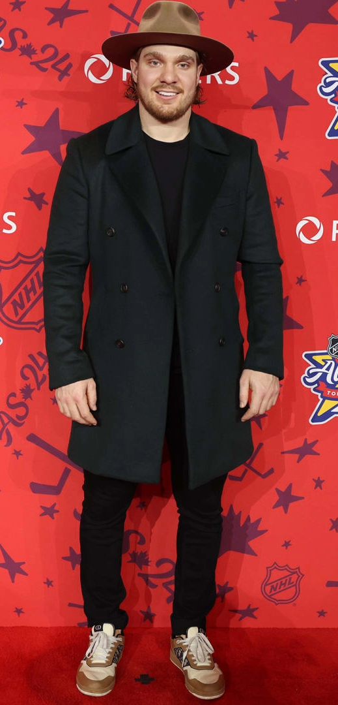

# Welcome to Ethan's Hockey Site
 This is a site dedicated to hockey statistics, most specifically the **St. Louis Blues**

## About The Blues
The **St. Louis Blues** are a professional hockey team located in St. Louis Missouri. The team came into existance in 1967, being one of six new teams added. They have one Stanley Cup win, coming in 2019. After a first round exit in 2025, they gear up for a new season starting October 9th against the **Minnesota Wild**.

<p align="center">
  
</p>

## Blues Players Backgrounds
In the game of hockey, points by a player is one of the most important things. A point is described as either a goal or an assist. The more points a player has, generally the better they are. During the 2024-25 season, **Robert Thomas** led the club in points with 81.

<div style="text-align: center;">
  
</div>

Of the 81 points **Thomas** had, only 21 came from goals. By this, you can tell that **Thomas** isn't the main scorer on the team, he is the facilitator. **Thomas's** favorite players to assist were **Jordan Kyrou** and **Pavel Buchnevich**, both with 9. This is not a surprise since this trio was the top line for St. Louis during the 24-25 season. This will likely change this season with **Kyrou** being swapped out of the top line for **Jimmy Snuggerud**.

The goalie for the Blues is **Jordan Binnington**. He came into the spotlight in 2019 leading the Blues to the Stanley Cup win. 

<div style="text-align: center;">
  
</div>

Many fans in hockey don't know if **Binnington** is a good goalie or not. Some people think that he is flashy, but doesn't perform that great all the time. How can we tell if he is a good goalie or not? Are there numbers to back up either way? Of course there is, lets dive in.

# Important Statistics
What are some stats that would be key in showing the effectiveness of a goalie? Maybe you want to see the total goals that have given up, maybe goals per game, or maybe even goals per 60 minutes. These could all be good indicators to whether a goalie is good or not. What we are going to do for this example is load in an excel file of all goalie information from the 24-25 season and see how effective **Binnington** truly was. 

To read an Excel file in Python using pandas:

```python
import pandas as pd

# Read your CSV file
df = pd.read_csv("data/goalies.csv")

# Filter for Jordan Binnington
binnington_df = df[df["name"] == "Jordan Binnington"]

# Preview his rows
print(binnington_df)

# Optional: save to Markdown for your GitHub Pages
binnington_df.to_markdown("binnington.md")

```
## Preview of Data

<div style="overflow-x:auto;">

|     |   playerId |   season | name              | team   | position   | situation   |   games_played |   icetime |   xGoals |   goals |   unblocked_shot_attempts |   xRebounds |   rebounds |   xFreeze |   freeze |   xOnGoal |   ongoal |   xPlayStopped |   playStopped |   xPlayContinuedInZone |   playContinuedInZone |   xPlayContinuedOutsideZone |   playContinuedOutsideZone |   flurryAdjustedxGoals |   lowDangerShots |   mediumDangerShots |   highDangerShots |   lowDangerxGoals |   mediumDangerxGoals |   highDangerxGoals |   lowDangerGoals |   mediumDangerGoals |   highDangerGoals |   blocked_shot_attempts |   penalityMinutes |   penalties |
|----:|-----------:|---------:|:------------------|:-------|:-----------|:------------|---------------:|----------:|---------:|--------:|--------------------------:|------------:|-----------:|----------:|---------:|----------:|---------:|---------------:|--------------:|-----------------------:|----------------------:|----------------------------:|---------------------------:|-----------------------:|-----------------:|--------------------:|------------------:|------------------:|---------------------:|-------------------:|-----------------:|--------------------:|------------------:|------------------------:|------------------:|------------:|
| 140 |    8476412 |     2024 | Jordan Binnington | STL    | G          | other       |             56 |      4316 |    11.5  |      13 |                       138 |        5.46 |          8 |     13.6  |        7 |     76.77 |       61 |           1.24 |             0 |                  43.47 |                    35 |                       25.48 |                         39 |                   9.24 |               57 |                  31 |                14 |              2.51 |                 3.65 |               5.35 |                4 |                   7 |                 2 |                      36 |                 0 |           0 |
| 141 |    8476412 |     2024 | Jordan Binnington | STL    | G          | all         |             56 |    194339 |   150.25 |     145 |                      3105 |      106.51 |        170 |    389.26 |      309 |   1593.57 |     1457 |          50.12 |             1 |                 863.61 |                   690 |                      624.59 |                        873 |                 140.54 |             1630 |                 381 |               177 |             45.29 |                46.99 |              57.97 |               53 |                  51 |                41 |                     917 |                 6 |           3 |
| 142 |    8476412 |     2024 | Jordan Binnington | STL    | G          | 5on5        |             56 |    165286 |   105.17 |     100 |                      2541 |       80.83 |        131 |    325.93 |      262 |   1275.58 |     1160 |          41.48 |             0 |                 690.28 |                   545 |                      512.72 |                        719 |                 101.55 |             1351 |                 290 |               117 |             37.27 |                36.1  |              31.8  |               46 |                  39 |                15 |                     783 |                 4 |           2 |
| 143 |    8476412 |     2024 | Jordan Binnington | STL    | G          | 4on5        |             56 |     13295 |    30.47 |      30 |                       371 |       18.2  |         30 |     43.61 |       37 |    204.61 |      195 |           0.84 |             0 |                 117.27 |                   101 |                       62.38 |                         81 |                  26.67 |              186 |                  51 |                42 |              4.5  |                 6.11 |              19.85 |                3 |                   5 |                22 |                      92 |                 0 |           0 |
| 144 |    8476412 |     2024 | Jordan Binnington | STL    | G          | 5on4        |             56 |     11442 |     1.97 |       1 |                        44 |        1.38 |          1 |      4.67 |        3 |     28.27 |       32 |           6.41 |             1 |                   9.39 |                     5 |                       20.69 |                         29 |                   1.95 |               33 |                   4 |                 2 |              0.94 |                 0.55 |               0.47 |                0 |                   0 |                 1 |                       5 |                 2 |           1 |

</div>

### Goals vs Expected Goals
