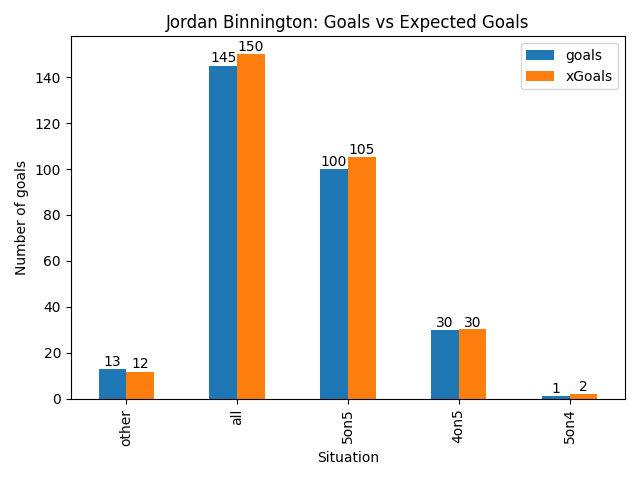

# Analyzing Blues Player Statistics using Python
 This is a site dedicated to hockey statistics, most specifically the **St. Louis Blues**

# About The Blues
The **St. Louis Blues** are a professional hockey team located in St. Louis Missouri. The team came into existance in 1967, being one of six new teams added. They have one Stanley Cup win, coming in 2019. After a first round exit in 2025, they gear up for a new season starting October 9th against the **Minnesota Wild**.

<p align="center">
  
</p>

## Blues Players Backgrounds
In the game of hockey, points by a player is one of the most important things. A point is described as either a goal or an assist. The more points a player has, generally the better they are. During the 2024-25 season, **Robert Thomas** led the club in points with 81.

<div style="text-align: center;">
  
</div>

Of the 81 points **Thomas** had, only 21 came from goals. By this, you can tell that **Thomas** isn't the main scorer on the team, he is the facilitator. **Thomas's** favorite players to assist were **Jordan Kyrou** and **Pavel Buchnevich**, both with 9. This is not a surprise since this trio was the top line for St. Louis during the 24-25 season. This will likely change this season with **Kyrou** being swapped out of the top line for **Jimmy Snuggerud**.

The goalie for the Blues is **Jordan Binnington**. He came into the spotlight in 2019 leading the Blues to the Stanley Cup win. 

<div style="text-align: center;">
  
</div>

Many fans in hockey don't know if **Binnington** is a good goalie or not. Some people think that he is flashy, but doesn't perform that great all the time. How can we tell if he is a good goalie or not? Are there numbers to back up either way? Of course there is, lets dive in.

# Important Statistics
What are some stats that would be key in showing the effectiveness of a goalie? Maybe you want to see the total goals that have given up, maybe goals per game, maybe even goals per 60 minutes, 
$$
\text{G/60} = \frac{\text{Goals Allowed}}{\text{Ice Time (minutes)}} \times 60
$$
 or save percentage,
 $$
\text{SV\%} = \frac{\text{Shots Faced} - \text{Goals Allowed}}{\text{Shots Faced}}
$$
 These could all be good indicators to whether a goalie is good or not. What we are going to do for this example is load in an excel file of all goalie information from the 24-25 season and see how effective **Binnington** truly was. A link to download the file is found here on the MoneyPuck.com website, as they are the ones that collected the data: [Goalie Data](https://moneypuck.com/data.htm). Scroll down to goalies and download the 2024-2025 file.

To read an Excel file in Python using pandas:

```python
import pandas as pd
# Read your CSV file from your "data" folder
df = pd.read_csv("data/goalies.csv")

# Filter for Jordan Binnington
binnington_df = df[df["name"] == "Jordan Binnington"]

# Keep only the columns you care about
# Example: "team", "position", "games_played", "goals", "xGoals"
tidy_df = binnington_df[["games_played", "situation", "icetime", "goals", "xGoals"]]

# Preview the tidy DataFrame
print(tidy_df)

# Optional: save to Markdown for your GitHub Pages
tidy_df.to_markdown("binnington.md")

```
Inputing the code without tidying it up will result in a lot more data than we are interested in. When we run this chunk in python, we will get this chart

## Preview of Data

| name | team | position | situation | games_played | icetime | xGoals | goals |
|------|------|---------|-----------|--------------|---------|--------|-------|
| Jordan Binnington | STL | G | other | 56 | 4316 | 11.5 | 13 |
| Jordan Binnington | STL | G | all   | 56 | 194339 | 150.25 | 145 |
| Jordan Binnington | STL | G | 5on5  | 56 | 165286 | 105.17 | 100 |
| Jordan Binnington | STL | G | 4on5  | 56 | 13295 | 30.45 | 30 |
| Jordan Binnington | STL | G | 5on4  | 56 | 11442 | 1.97  | 1 |

### Goals vs Expected Goals
If we want to chart the data, we can use this function
```python
import pandas as pd
import matplotlib.pyplot as plt

df = pd.read_csv("data/goalies.csv")
binnington = df[df["name"] == "Jordan Binnington"]

# Bar chart of goals vs xGoals
bar = binnington.plot.bar(x="situation", y=["goals", "xGoals"])

bar.set_title("Jordan Binnington: Goals vs Expected Goals")
bar.set_xlabel("Situation")
bar.set_ylabel("Number of goals")

for p in bar.patches:
    height = round(p.get_height())  # Round the value
    bar.annotate(f'{height}',
                (p.get_x() + p.get_width() / 2, height + 0.1),  # Slightly above bar
                ha='center', va='bottom')

# Save figure
plt.tight_layout()

plt.savefig("images/binnington_goals.png")
```




## So what?
What conclusions can we draw from this data? From this data we can see that in every situation listed like 5 on 5 or on a 5 on 4 powerplay, **Jordan Binnington** lets up less goals than is expected of him. The only situations where he gives up more than expected is in the other situations, like up 5 on 3 or down 3 to 5. For a goalie, that is a really good thing, stoping more shots than expected. 

One of the best parts about this analysis is that you can look at any goalie in the data set. If you wanted to see how good **Joel Hofer**, the Blue backup goalie, is compared to Binnington, you just need to replace Jordan Binnington with Joel Hofer and it will compute for you. 